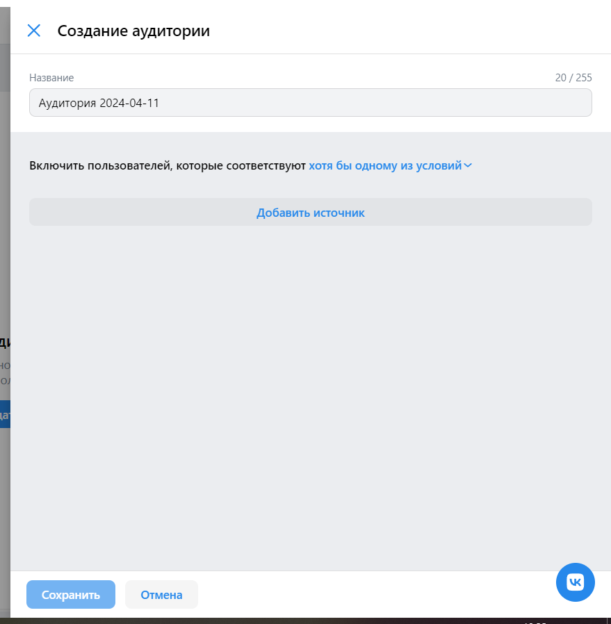
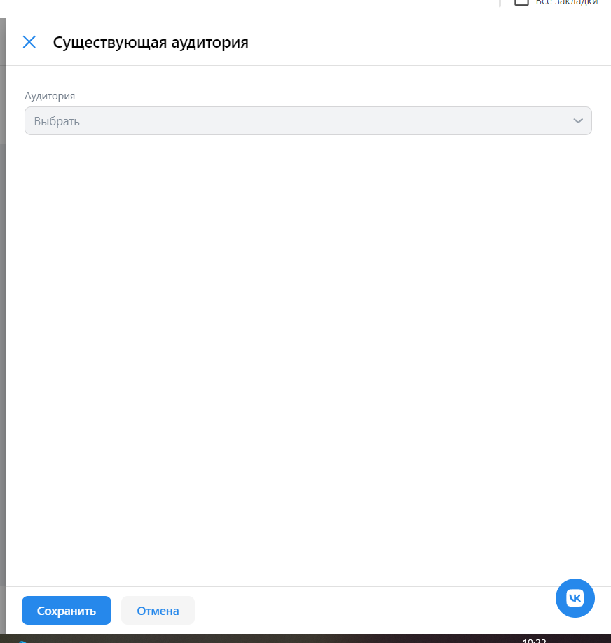
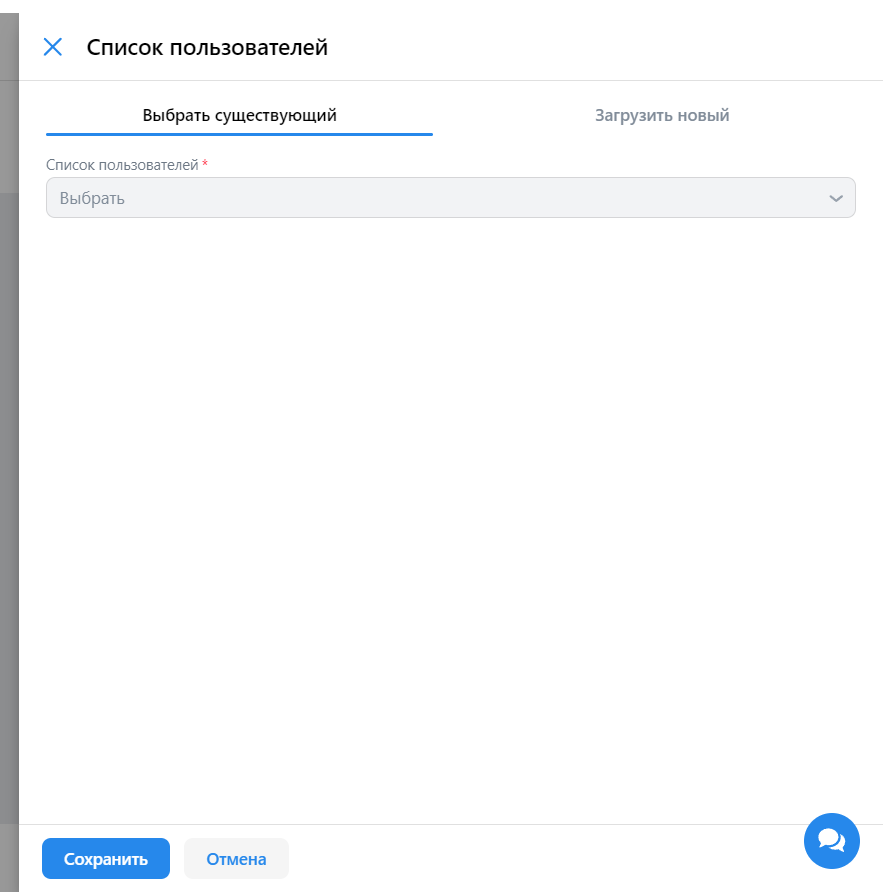
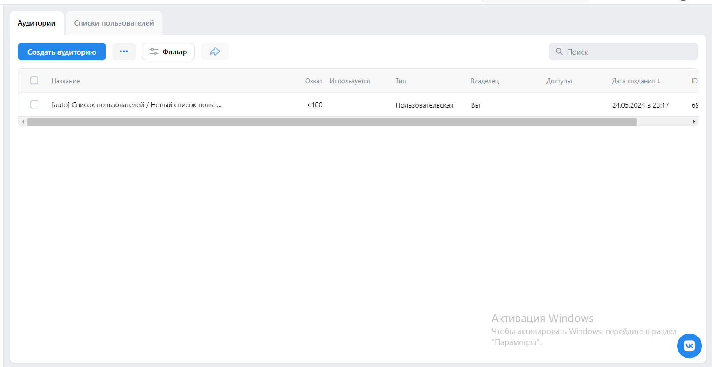
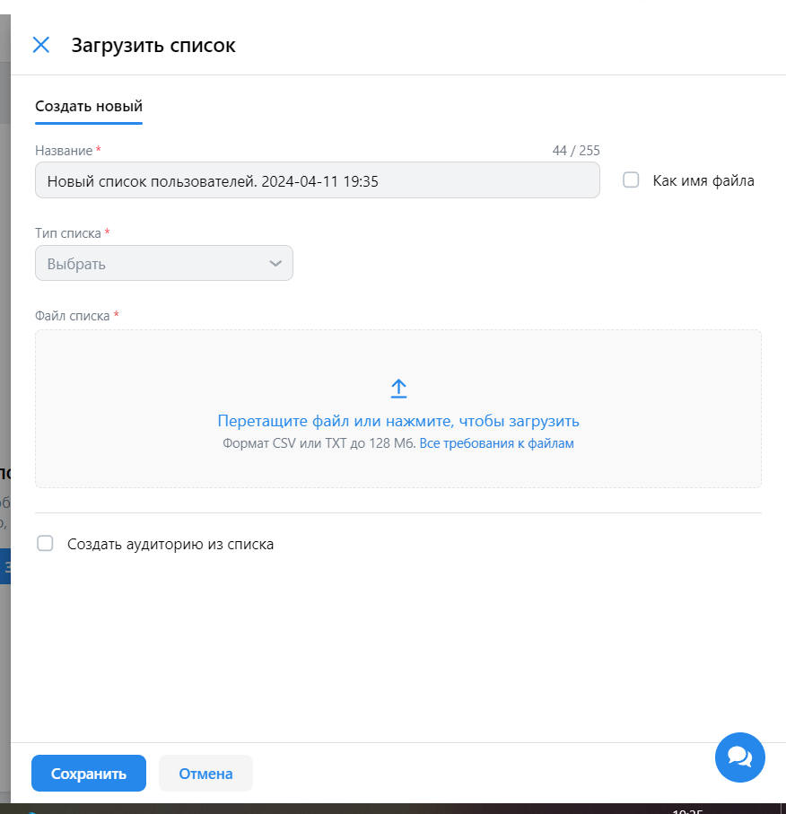

# Чек-листы ads.vk.com

## Аудитории

### Аудитории. Создание

#### URL https://ads.vk.com/hq/audience

- Создание аудитории. При нажатии "Создать аудиторию" появляется боковое окно справа.
- Создание аудитории. При выборе типа применения условий появляется выпадающий список.
- Создание аудитории. При клике вне бокового окна появляется модалка о прерывании создания.
- Создание аудитории. При подтверждении прерывания закрывается боковое окно, и новая аудитория не появляется в списке.
- Создание аудитории. При отмене прерывания боковое окно остается открытым.
- Источник аудитории. При нажатии "Добавить источник" появляется боковое окно справа.
- Источники аудитории. Существующая аудитория. При вводе названия аудитории появляется выпадающий список со всеми доступными аудиториями.
- Источники аудитории. Существующая аудитория. При выборе названия аудитории из выпадающего список оно отображается в форме.
- Источники аудитории. Список пользователей. Существующий список. При вводе списка пользователей появляется выпадающий список со всеми доступными списками.
- Источники аудитории. Список пользователей. Создание списка. При нажатии "Как имя файла" поле ввода имени файла становится неактивным.
- Источники аудитории. Список пользователей. Создание списка. При выборе типа списка из выпадающего список он отображается в форме.
- Источники аудитории. Список пользователей. Создание списка. После загрузки списка он появляется в списках создаваемой аудитории.
- Источники аудитории. Список пользователей. Создание списка. После загрузки списка он появляется в списке списков пользователей.
- Источники аудитории. Список пользователей. Создание списка. При загрузке списка невалидного формата появляется модалка с ошибкой.
- После загрузка списка при нажатой галочке "Как имя файла" название списка совпадает с файлом.
- Источники аудитории. Список ключевых фраз. После ввода ключевой фразы появляется кнопка "показать 10 похожих".
- Источники аудитории. Список ключевых фраз. При нажатии на "показать 10 похожих" появляется выпадающий список с похожими фразами.
- Источники аудитории. Список ключевых фраз. При выборе похожей фразы из списка она отображается в форме.
- Источники аудитории. Список ключевых фраз. После сохранения он появляется в списках создаваемой аудитории.
- Источники аудитории. Список подписчиков сообщества. После выбора результата поиска сообщества он появляется в списке формы.
- Источники аудитории. Список подписчиков сообщества. После сохранения он появляется в списках создаваемой аудитории.
- Источники аудитории. Список подписчиков сообщества. После сохранения пропадает кнопка добавления источника.
- Источники аудитории. Список слушателей исполнителя. После выбора результата поиска исполнителя он появляется в списке формы.
- Источники аудитории. Список слушателей исполнителя. После сохранения он появляется в списках создаваемой аудитории.
- Источники аудитории. Список слушателей исполнителя. После сохранения пропадает кнопка добавления источника.

### Аудитории. Список аудитории

#### URL https://ads.vk.com/hq/audience

- Сортировка. Сортировка по текстовым столбцам располагает данные в алфавитном порядке.
- Сортировка. Сортировка по числовым столбцам располагает данные в порядке возрастания.
- Сортировка по столбцам с датами располагает данные в хронологическом порядке.
- Фильтры. При выборе фильтра по источнику аудитории в списке аудиторий остаются только те аудитории, которые имеют этот источник.
- Фильтры. При выборе нескольких фильтров в списке остаются аудитории, имеющие все выбранные фильтры.
- Фильтры. При отсутствии подходящих аудиторий появляется надпись "Ничего не найдено".
- Редактирование аудитории. После изменения названия аудитории она отображается в списке с обновленным именем.
- Редактирование аудитории. После добавления нового источника он отображается в списке источников аудитории.
- Редактирование аудитории. При клике вне бокового окна появляется модалка о прерывании редактирования.
- Редактирование аудитории. При подтверждении прерывания закрывается боковое окно, и новая аудитория не появляется в списке.
- Редактирование аудитории. При отмене прерывания боковое окно остается открытым.
- Удаление аудитории. После удаления аудитория не отображается в списке аудиторий.

### Списки пользователей. Создание

#### URL https://ads.vk.com/hq/audience

- При нажатии "Как имя файла" поле ввода имени файла становится неактивным.
- При выборе типа списка из выпадающего список он отображается в форме.
- После загрузки списка он появляется в списках создаваемой аудитории.
- После загрузки списка он появляется в списке списков пользователей.
- После загрузка списка при нажатой галочке "Как имя файла" название списка совпадает с файлом.
- После загрузка списка при нажатой галочке "Создать аудиторию из списка" появляется соответствующая аудитория.
- При загрузке списка невалидного формата появляется модалка с ошибкой.
