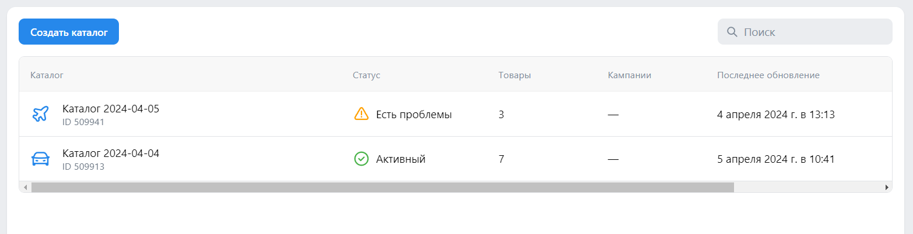
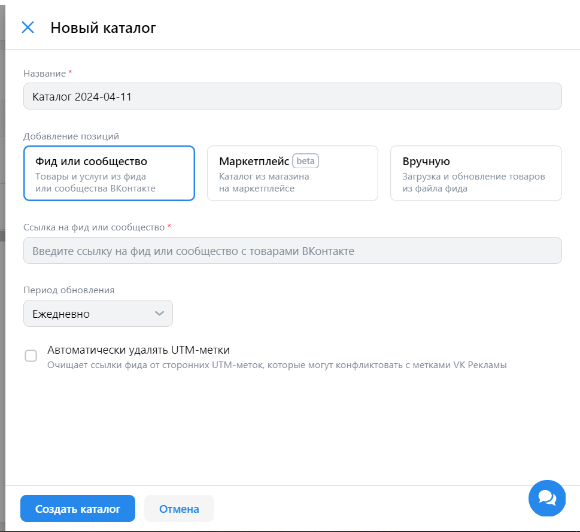
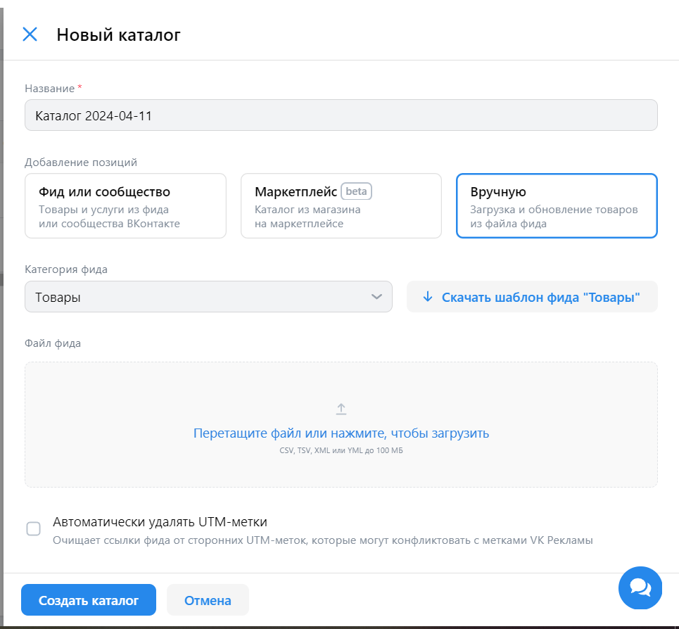
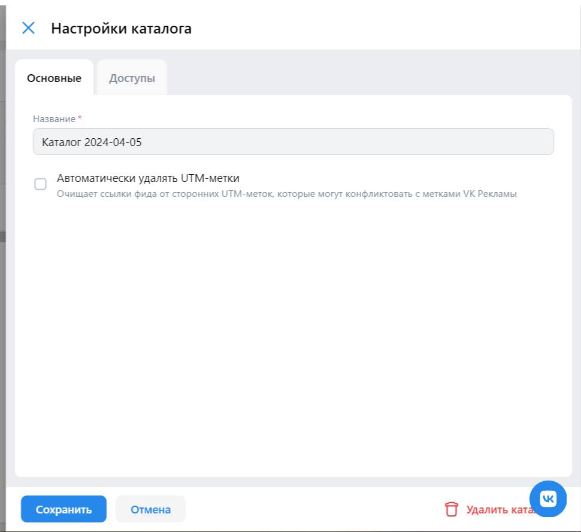
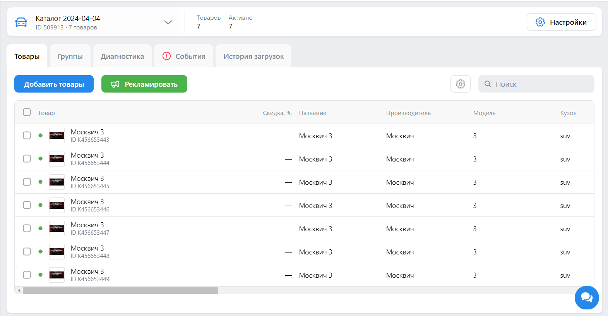
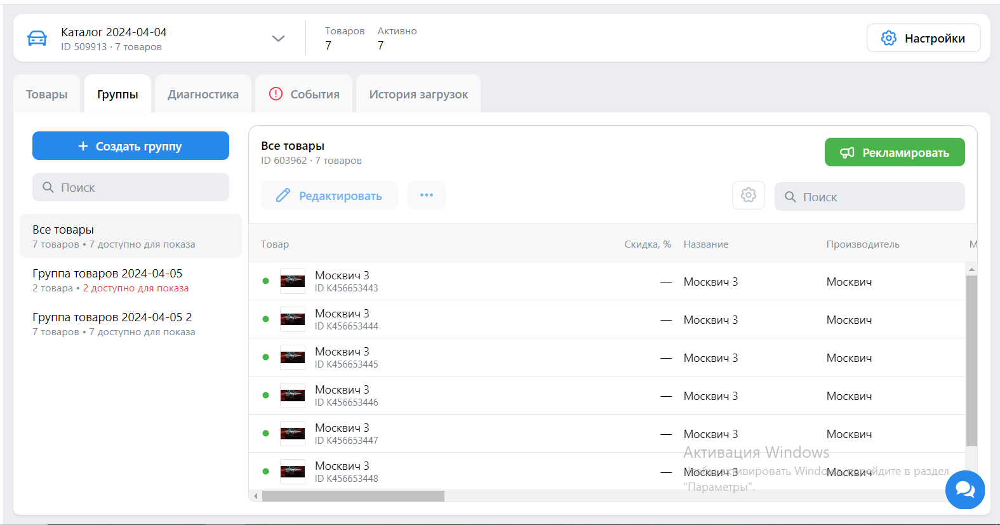
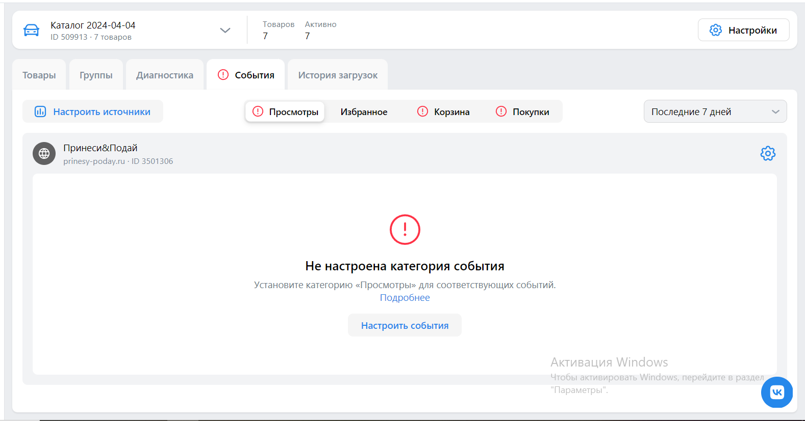

# Чек-листы ads.vk.com

## Центр коммерции

### Список каталогов

- Поиск каталогов. Поиск каталогов находит все каталоги, в названии которотых есть вхождение поискового запроса
- Поиск каталогов. При отсутствии каталогов, в названии которых есть вхождение поискового запроса, появляется сообщение "Ничего не найдено"
- Удаление каталога. После удаления каталога он исчезает из списка каталогов
- Открытие настроек каталога. Настройки каталога открываются в боковом окне справа.

### Создание каталога

- Создание каталога из фида по ссылке. Содержание каталога совпадает с содержанием фида.
- Создание каталога из загружаемого фида. Содержание каталога совпадает с содержанием фида.
- Создание каталога из загружаемого фида. При загрузке фида невалдиного формата пользователь получает отчет об ошибке.

### Настройки каталога

- Изменение имени каталога. После изменения имени каталога он отображается в списке с новым именем.

### Каталог. Список товаров

- Просмотр карточки товара. Подробная информация о товаре отображается в боковом окне справа.
- Обновление списка товаров. После обновления списка товаров и новые, и старые товары отображаются в каталоге.
- Замена списка товаров. После замены списка товаров в каталоге отображаются только новые товары.
- Сортировка товаров. Сотрировка по тексовым столбцам располагает данные в алфавитном порядке.
- Сортировка товаров. Сотрировка по числовым столбцам располагает данные в порядке возрастания.
- Сортировка товаров. Сотрировка по столбцам с датами располагает данные в хронологическом порядке.
- Изменение колонок таблицы товаров. При добавлении колонки в списке колонок она отображается в таблице товаров.
- Изменение колонок таблицы товаров. При удалении колонки в списке колонок она исчезает из таблицы товаров.

### Каталог. Группы

- Создание группы вручную. Группа состоит из выбранных товаров.
- Создание группы по фильтрам. Группа состоит из товаров, удовлетворяющих фильтрам.
- Создание копии группы. Группа и копия группы содержат одинаковые товары.
- Редактирование группы. После удаления товара из группы он не отображается в списке товаров группы.
- Редактирование группы. После добавления товара в групп он отображается в списке товаров группы.

### Каталог. События

- Добавление источника событий. После добавления пикселя он отображается в списке источников.

### Каталог. История загрузок

- Обновление списка товаров. После обновления списка товаров и новые, и старые товары отображаются в каталоге.
- Замена списка товаров. После замены списка товаров в каталоге отображаются только новые товары.

## Кампании

### Настройка кампании

- Выбор рекламируего объекта. После выбора рекламируемого объекта появляются настройки данного объекта.
- Настройка кампании сайта. При вводе ссылки на сайт появляется выпадающий список с сайтами из одноименного раздела.
- Настройка кампании каталога товаров. При нажатии на каталог товаров появляется выпадающий список с созданными каталогами.
- Настройка банерной рекламы. При вводе ссылки на сайт появляется выпадающий список с сайтами из одноименного раздела.

### Группа объявлений

- Выбор регионов показа. При попытке создать группу без регионов показа появляется сообщение об ошибке.
- Выбор регионов показа. После добавления вручную региона он оторбражается в списке регионов.
- Выбор регионов показа. После удаления региона он исчезает из списка регионов.
- Выбор регионов показа. Содержание списка регионов совпадает с содержанием файла.
- Интересы и поведение. При вводе инетерсов появляется выпадающий список с инетерсами.
- Интересы и поведение. После добавления вручную региона он оторбражается в списке регионов.
- Интересы и поведение. После удаления региона он исчезает из списка регионов.
- Пользовательские аудитории. При вводе названия аудитории появляется выпадающий список со всеми доступными аудиториями.

### Объявления

- Заголовок. При попытке создать объявление без заголовка появляется сообщение об ошибке.
- Короткое описание. При попытке создать объявление без короткого описания появляется сообщение об ошибке.

## Аудитории

### Аудитории

- Создание аудитории. При нажатии "Создать аудиторию" появляется боковое окно справа.
- Источники аудитории. При нажатии "Добавить источник" появляется боковое окно справа.
- Источники аудитории. Существующая аудитория. При вводе названия аудитории появляется выпадающий список со всеми доступными аудиториями.
- Источники аудитории. Список пользователей. При вводе списка пользователей появляется выпадающий список со всеми доступными списками.

### Списки пользователей

- Загрузка списка пользователей. Содержание списка пользователей совпадает с содержанием файлов.

## Бюджет

### Пополнение счета

- При попытке пополнить счет с пустой суммой платеха появляется сообщение об ошибке.
- Пополнение счета через СБП. При пополнении через СБП появляется фрейм СБП.
- Пополнение счета через Gazprom Pay. При пополнении через Gazprom Pay происходит редирект на новую страницу.
